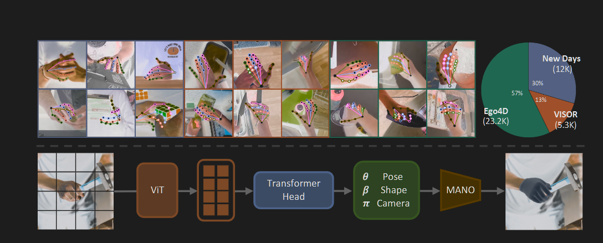

# 交叉注意力（多模态的core！多模态信息的交融，让不同模态的信息也能互相交流）

1. 纯自注意力的痛点（计算“冗余”与大海“捞针”）：> 1. 背景噪声的干扰多：如果都互相看来看去，那么大部分信息都会被背景像素给稀释了 > 2. 计算量太大：是O($N^{2}$)量级的，对于回归几个MANO参数来说毫无必要。
   自注意力是在“开全员大会”：196 个 Patch 每个人都在跟其他人说话，大家一起开会融合全局信息。

交叉注意力是在“派侦探办案”：模型预先设定好几个聪明的“侦探”（Query Token，比如专门负责找手腕的、专门负责找指尖的）。

这群“侦探”作为 $Q$，拿着放大镜去 196 个视觉 Patch（作为 $K$ 和 $V$）的仓库里大喊：“别废话，告诉我手关节在哪里！把背景都过滤掉！”

通过这种机制，交叉注意力强行把“稠密的视觉空间（Dense Spatial Pixels）”转化为“稀疏的、面向任务的语义特征（Sparse Task-Specific Features）”。它只把对预测手部姿态 $\theta$ 和形状 $\beta$ 有用的干货吸收到 Query 里，把杂乱的背景直接抛弃。

**_维度问题_**：自注意力机制输出和输入的维度不变，依旧是一大坨，之后还需要压缩，那么就会造成信息的干扰和有效信息的稀释。
而交叉注意力则不然：他的输出完全由Query数量决定，输出维度的行数和Query一摸一样
比如Query是（2，1，196）
V是（2，196，1280）
最后输出就会变成（2，1，1280），非常好的降维方式！！！
至于Query的个数设置，依然是“我们也不知道它到底在提取什么东西”，一般我们根据我们之后需要的内容设计个数。在这个论文中，我们需要的是MANO数据，也就是几个参数，所以没有设置这么多query。但是如果你想直接预测骨骼等等细节，可以考虑多设计一些query。但是记住“他们也不知道自己在问什么！”，所以有的时候加了完全有可能没什么效果，反而还拖慢了模型的速度。

HaMeR：

loss：
在 **HaMeR** 论文中，作者采用了一套组合损失函数（Loss Function）来对模型进行全方位监督，主要由 **3D 损失**、**2D 重投影损失**以及**对抗损失**三部分组成。

## 具体的数学表达式和详细解释如下：

### 1. 3D 损失 ($\mathcal{L}_{3D}$)

- **适用场景**：当训练样本带有 3D 真实标签（Ground Truth）时使用。
- **核心作用**：直接在参数空间和 3D 坐标空间对模型进行强约束，确保预测的底层参数和三维结构准确无误。
- **数学公式**：
  $$\mathcal{L}_{3D} = \Vert{}\theta - \theta^*\Vert{}_2^2 + \Vert{}\beta - \beta^*\Vert{}_2^2 + \Vert{}X - X^*\Vert{}_1$$
- **详细解释**：
- $\Vert{}\theta - \theta^*\Vert{}_2^2$：对 48 维的手部姿态参数 $\theta$ 计算 **L2 损失（均方误差）**，$\theta^*$ 为真实姿态参数。
- $\Vert{}\beta - \beta^*\Vert{}_2^2$：对 10 维的手部形状参数 $\beta$ 计算 **L2 损失**，$\beta^*$ 为真实形状参数。
- $\Vert{}X - X^*\Vert{}_1$：对 3D 关节点位置 $X$（共 21 个关节）计算 **L1 损失（绝对值误差）**，$X^*$ 为真实的 3D 关节坐标。

---

### 2. 2D 重投影损失 ($\mathcal{L}_{2D}$)

- **适用场景**：无论样本是拥有 3D 标签，还是只有 2D 关键点标注，都会应用此项损失。
- **核心作用**：利用相机参数将预测出的 3D 关节投影回 2D 图像平面，保证模型在图像像素空间上的对齐和一致性。
- **数学公式**：
  $$\mathcal{L}_{2D} = \Vert{}x - x^*\Vert{}_1$$
- **详细解释**：
- $x$ 是模型预测的 3D 关节经过相机参数投影后的 2D 坐标（$x = \Pi_K(X+t)$）。
- $x^*$ 是数据集中真实的 2D 关键点标注。
- 计算两者的 **L1 绝对值误差**，让预测的手骨架在画面上严丝合缝地对准图片中的手。

---

### 3. 对抗损失 ($\mathcal{L}_{adv}$ / Adversarial Loss)

- **适用场景**：当使用大量只有 2D 标注的野生数据集（In-the-wild datasets）时尤为重要。
- **核心作用**：防止模型为了单纯迎合 2D 投影而扭曲出人类根本做不到的“畸形手势”（因为仅靠 2D 监督时，模型有时会把手扭曲成奇奇怪怪的形状但碰巧也能投影到 2D 点上）。
- **数学公式**：
  $$\mathcal{L}_{adv} = \sum_{k} (D_k(\Theta) - 1)^2$$
- **详细解释**：
- 模型引入了多个判别器（Discriminators $D_k$），分别独立监督：a) 手部形状 $\beta$，b) 手部姿态 $\theta$，c) 每一个单独的手部关节角度。
- 通过对抗训练，迫使网络生成的参数 $\Theta$ 必须落在真实人类手部参数的合理分布范围内，确保最终生成的手部形态符合解剖学规律（自然、逼真）。

---

### 总结

HaMeR 的整体监督是由这三者共同构成的：**$\mathcal{L}_{3D}$ 负责抓三维绝对精度，$\mathcal{L}_{2D}$ 负责抓二维图像对齐，$\mathcal{L}_{adv}$ 则负责把关人类手部的解剖学合理性**。通过这三类损失的联合加权训练，模型才能够在海量的多源混合数据上具备极高的鲁棒性。
