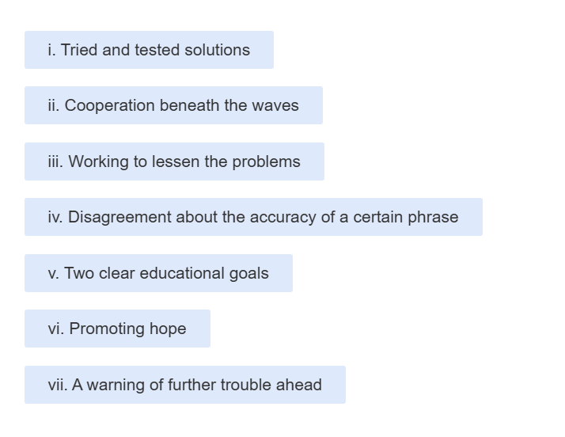
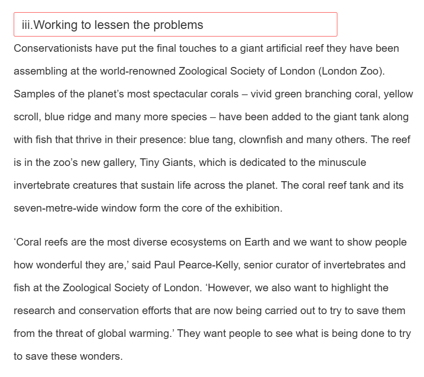
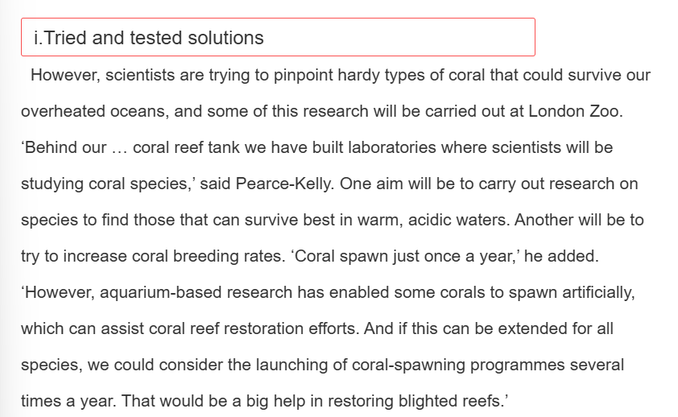
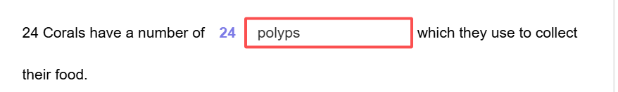

# C20T3P2

### 生词积累

| 单词               | 释义               |
| ------------------ | ------------------ |
| reef               | n.礁               |
| spectacular        | adj.壮观的         |
| coral              | n.珊瑚             |
| thrive             | v.茁壮成长，兴旺   |
| dedicate           | v.致力于           |
| minuscule          | adj.极小的         |
| invertebrate       | n.无脊椎动物       |
| **_curator_**      | \*\*\*n.策展人     |
| tentacle           | n.触手             |
| _marine_           | adj.海洋的         |
| tones              | n.色调             |
| algae              | n.藻类             |
| systhesis          | n.（化学）合成     |
| photosysthesis     | n.光合作用         |
| nutrient           | n 营养             |
| dismiss            | v 忽视             |
| thermal            | adj 热的           |
| bleach             | v 漂白 n 漂白剂    |
| strip              | v 剥去             |
| menace             | n 威胁 v 威胁      |
| chunk              | n 大块，相当大部分 |
| erosion            | n 侵蚀             |
| 派生：erode eroded | v侵蚀 adj被侵蚀的  |
| pinpoint           | v准确确定          |
| hardy              | adj 坚强的         |
| aquarium           | n 水族馆           |
| spawn v 产卵       |

### 错题分析

> 错因：生词有点多，没读懂导致对段意有点混乱，看到save就觉得是working to lessen 了。而且，**_部分对就可以_**，概括对应的是下一段的内容

> 错因：应该先想想“如果总结是这个，段落会怎么写”，这一段虽然有已经test过的方法，但是也有will，trying等未实现的想法，所以tried and tested solutions不合适。

> 这个题其实我不太理解，原文是：Corals are composed of tiny animals, known as polyps, with tentacles for capturing small marine creatures in the sea water.所以应该是corals有tiny animals，animals有tentacles，但是问的是corals啊，所以我填的polyps。

> 错因：这道题定位没问题，意思也大概读懂了，只是一开始觉得color不能remove，导致把自己搞懵了，然后就把一些生词的意思从猜测正确歪曲成不正确的了。
