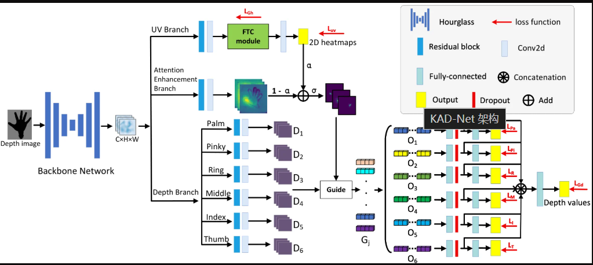

# 整体逻辑

深度图输入，经过一个Hourglass的特征提取算法（包含CNN），获得多个手部通用信息矩阵。
分三条线路：

1. UV热力图
   > 通过残差块获取更深度的信息，经过Convd2d的维度匹配，送入FTC（手部约束信息传递GNN）。第一步是划分节点位置，首先会经过一次空间注意力，获得到底哪里是哪里的信息（给全图打上权重）。因为是CNN，所以这里获得的位置信息是初稿，是不准确的。然后根据这个权重，给每一张图（一个特征对应一个图）进行一次加权融合，获得这个部位的特征数字。最后就能获得所有关节的32个特征的32维度向量。然后根据拓扑结构进行特征的修改，最后就获得了各个关节的所有特征。然后就是重定位，利用这些信息，再重新构建热力图，真正表明关节所在位置。
2. 注意力增强分支
   > 和前面一样，这里的残差块对通用特征进行深加工，让网络专门去寻找那些对推算 3D 深度距离最有用的视觉线索（比如手指交叉时的重叠边缘、阴影渐变、局部的凸起等）接着，模型通过一层 Conv2D（卷积），把厚度调整、压缩，最终输出了一张被称为注意力增强图，它是张单层或者多层的二维图，里面的数字代表“深度线索的强烈程度”（不是准确的距离镜头多远，而是“这里的深度线索的重要性”的权重图）。哪里有阴影或遮挡边缘，哪里的数值就高。因为它不是给“整只手”画一张总图，而是为手上的每一个关节都单独准备了一张专属的聚光灯地图。然后这个和前面的UV热力图进行可学习参数alpha融合。获得***融合注意力图***，它既有坐标靶心，又有深度线索，是一个聚光灯模板。
3. 深度分支
   > 通过给每一个手指设计的残差块和convd2d，获得关于这个手指的各个特征（包含各种信息，包括深度），然后通过上面的融合注意力图（权重图）进行掩码，得到干净的特征图。然后每一个特征层求和变成一个数字，得到关节深度特征向量。然后通过全连接层获得深度，然后所有手指的深度信息拼接在一起，再经过一个全连接层，得到最后所有关节的深度。

既然全连接层（FC）在数学上是“万能近似器”，为什么我们还要费尽心思去设计像 KAD-Net 这样错综复杂的模块？

> 注入“人类的先验知识（Inductive Bias，归纳偏置）”
> 将“不可能的复杂任务”拆解为“分而治之的小模块”
> 在“精度（Accuracy）”与“效率（Efficiency）”之间走钢丝
> 设计模型架构的核心目的，就是通过数学和拓扑的约束，引导 AI 像人类一样有逻辑、有层次、有效率地去拆解和解决复杂问题

## Q1.当你准备动手设计一个 AI 模型去攻克某个复杂目标时，其实就像在搭建一座精密的高精度工厂。从 KAD-Net 这套架构的成功中，我们可以提炼出四个在模型设计时必须时刻牢记的核心原则：

1. 明确任务冲突，做到“解耦与分工”
   核心痛点： 如果把两个“脑回路完全不同”的目标（例如既要找二维像素坐标，又要算三维物理距离）硬塞给同一个通道，模型往往会因为特征干扰而两头不讨好。

设计注意： 在动手前先审视你的目标里有没有“互相打架的子任务”。如果有，勇敢地像 KAD-Net 那样采用“单底座 + 多分支”的解耦设计，让专职的模块去干专职的事。

2. 注入“先验知识（归纳偏置）”，而不是让 AI 从零学常识
   核心痛点： 纯粹的深度学习黑盒非常消耗数据，且极其容易在遇到遮挡或极端情况时胡思乱想。

设计注意： 你的领域里有哪些“铁律”（比如物理公式、几何拓扑、化学约束、业务逻辑）？不要指望 AI 能自己从像素里悟出这些规律。要想办法把这些规则硬编码进网络架构中（例如用图神经网络表达骨骼，或者用特定公式限制输出范围），用常识去约束 AI 的想象力。

3. 坚持“分而治之”与“局部到全局”的组合拳
   核心痛点： 一口吃不成胖子。如果把一个庞大、复杂的宏观目标直接丢给一个全连接层或者大模型硬算，极易导致参数爆炸或过拟合。

设计注意：

先局部拆解： 把整体拆成若干个结构相似、规模较小的子任务（如 5 根手指独立成组），降低单模块的学习难度。

后全局统筹： 在末端设计一个聚合或协调机制（如最后的拼接与全局全连接层），把局部结果拉通，校准整体的协调性。

4. 严格把控特征的“接口对齐”
   核心痛点： 很多模型设计到中途崩塌，往往是因为上一个模块输出的东西，下一个模块根本“听不懂”（比如把抽象向量直接塞给需要二维网格的像素层）。

设计注意： 在设计数据流向时，要像写软件代码定义 API 一样清晰：当前模块输出的张量形状是什么？它到底代表的是空间坐标、概率权重，还是物理特征？ 确保每一个变换（如注意力池化、重映射、降维）都有明确的物理和数学意义。

## Q2.然后就是维度怎么设计呢？这里面就又很多次用convd2d去调整维度，作者是基于什么考虑？我设计的时候在维度方面有什么需要注意的呢？

维度设计（Shape Design）是搭建神经网络时最考验功力的“管道工程”。在 KAD-Net 中，作者频繁使用 `Conv2d`（尤其是 $1 \times 1$ 卷积）来调整通道维度，这背后有着非常严密的工程考量。

我们分两部分来拆解：**作者为什么要用 `Conv2d` 调维度**，以及**你自己设计模型时有哪些“坑”和“黄金法则”**。

---

### 一、 作者频繁用 `Conv2d` 调整维度的底层考量

在代码里，这种用于调维度的 `Conv2d` 绝大多数都是 **$1 \times 1$ 卷积**。它在架构中主要扮演三种角色：

#### 1. “语言翻译器 / 接口适配”

- **场景：** 骨干网络（Hourglass）吐出来的特征厚度可能是 256 层，但后面的图神经网络（FTC 模块）内部写死了规则：我只接收 64 维的节点特征。
- **考量：** 模块和模块之间“语言不通”。$1 \times 1$ 卷积就像一个万能适配器，不改变画面的长宽（$H \times W$），只把厚度（Channels）从 256 压缩到 64，让下游模块能够无缝接收.

#### 2. “保留空间的通道压缩”

- **考量：** 为什么不用全连接层或直接截断丢弃通道，而一定要用 `Conv2d`？
  因为 `Conv2d` 可以在不破坏空间结构（$H \times W$）的前提下，对通道进行线性的信息重组。它会把 256 层里冗余、重复的信息，通过卷积权重浓缩压缩进 64 层里，尽可能不丢失核心特征。

#### 3. “任务数量的强行对齐”

- **场景：** 最后一层要把特征变成热力图时，手上有多少个关节，就必须输出多少张图（比如 21 个关节就要 21 张图）。
- **考量：** 前面提取的特征厚度是 64 层，必须用一层 `Conv2d` 把通道数精准“裁剪”或“映射”到目标任务的个数（比如 21 层），这样每一层才能对应一个专属关节的热力图。

---

### 二、 你自己设计模型时，维度（Dimension）需要注意什么？

当你从零设计一个模型时，维度设计如果没做好，轻则报错（Shape mismatch），重则模型学不会。以下是四个必须刻在脑子里的核心原则：

#### 1. 制定严格的“接口契约（Interface Contract）”

- **注意点：** 写代码前，先在纸上画出张量（Tensor）流向的 **Shape 演变路线图**。
- 例如：`Input [B, 3, 128, 128]` $\rightarrow$ `Backbone [B, 256, 64, 64]` $\rightarrow$ `Adapter [B, 64, 64, 64]`。
- 每一个模块的输出 Shape 必须严丝合缝地对齐下一个模块的输入要求。任何一个地方对不上，整个网络就会瘫痪。

#### 2. 警惕“维度灾难”（计算量与显存的平衡）

- **注意点：**
- 别盲目追求大通道（比如动不动把所有层设成 512 或 1024 通道），那会让显存瞬间爆炸。
- **黄金法则：** 在特征图空间分辨率很大（$H, W$ 很高）的时候，通道数（$C$）要保持相对克制；当空间分辨率通过池化或卷积缩小时（$H, W$ 变小），才可以适度增加通道数（$C$），用深度换取抽象能力。
- 善用 $1 \times 1$ 卷积作为**瓶颈结构（Bottleneck）**，在做大运算前先降维，能省下大量计算资源。

#### 3. 维度的“语义对齐”原则

- **注意点：** 频道的数量最好有明确的**现实物理或业务含义**，不要拍脑袋定数字。
- 比如 KAD-Net 中：分 6 个子任务，通道数就按手指逻辑分；需要 21 个关节，输出通道就设为 21。让维度和你的任务目标（如类别数、关节数、分类数）直接挂钩，代码的可读性和 Debug 难度会呈指数级下降。

#### 4. 搞清楚什么时候该“降维/坍缩”，什么时候该“升维”

- **注意点：**
- **空间降维（Pooling / Stride Conv）：** 为了扩大视野（感受野），抛弃过多的像素细节，提取宏观轮廓。
- **特征升维（Channel Expansion）：** 当进入复杂的非线性推理时，适度增加通道厚度，给模型提供足够的“思考空间”。
- **空间坍缩（Attention Pooling / Global Sum）：** 就像我们前面讨论的，当需要把一张图变成一个向量去送进全连接层时，必须果断用加权求和把 $H \times W$ 彻底消灭掉。

总结来说，维度设计就像是**给数据流规划高架桥和匝道**：宽窄要适中、接口要对齐、分流要合理。只要把每个节点输入的 Shape 算清楚，你的模型架构就成功了一大半！
