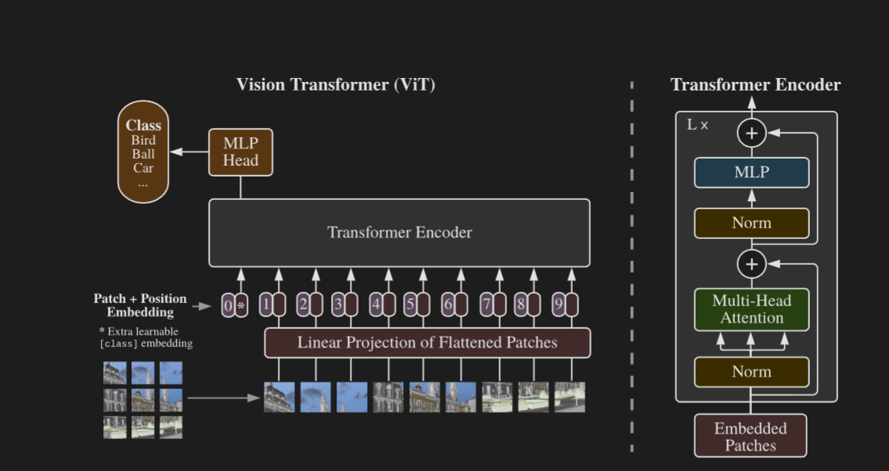

首先我算是了解到了MLP这个“朴素”的结构的强大了，它简直就是一个小型人脑，它实际上可以模仿世界上任意的一个运算，无论是你已知，还是未知。

思路如下：

1. 先把图像拆分成若干小块，每一个小块给他拆开，拉直变成1维向量。
2. 经过一个“参数可学习”的矩阵，变成维度是D的向量（这一步既完成了embedding，也完成了维度的匹配）同时设计一个完全随机的D维向量加到序列的头部（整合信息）
   > 很神奇，其实embedding就是任何一个可学习的，把输入变成一串输出向量的，都叫做embedding，也都能实现，只不过看结构的变化。这里使用的就是最最最简单的一个矩阵，甚至没有MLP。他也说了，他没有使用二维感知未知编码，因为效果没有明显提升。
3. 加入一个未知编码（$Value_{1} + P_{1}$），位置编码非常非常重要。**_首先，transformer如果没有掩码（对于多模态任务，不能用掩码，因为没有顺序这个概念，只有相对位置这个概念），它是平移恒定的，也就是没有位置概念，怎么改变位置，对输出的本质没有改变_**，所以作者设计了一个D维度的向量，开始是随机，后来训练称为位置向量。（_这里面很好玩，也没人限制他，为什么最后就会变成位置向量呢？_，本质是***它计算的时候始终是第一个维度加D的第一个维度的数字，无论前面的特征向量怎么变，这里都不变，所以如果模型希望想“如果我要更好的结果”，我需要从上下关系入手，这时候因为前面的特征向量一直在变，所以模型就知道了，这个信息我需要编码在位置向量里面。这就说明了，结构和目的是相辅相成的，但是结构的设计要符合道理才能有结果，否则可能和你想的完全不一样了***）

4. 然后就进入Transformer，就是多头注意力，MLP的多次循环，然后只取第一个那个开始完全随机的那个向量（维度少，MLP的输入维度可以控制，不然图像的像素点太多，输入太庞大了），经过一个MLP，得到分类答案。

告诉我们一个道理：相信MLP，相信Transformer

9-21日新内容：
里面的维度知识，设计知识：

1. 如何解决transformer的参数爆炸问题？

   > 利用分块，让输入transformer的**序列**长度变小（16x16的方格，所以注意，参数爆炸的问题往往需要注意的是***序列长度***而不是单个序列的长度（次要！）），从几万序列（一个像素一个像素的输入）变成了196个序列。

2. D矩阵***把768（16x16x3）维度，增加到了1024维度***
   > 奇怪，如果要解决参数爆炸的问题，应该降低维度啊？
   > **_千万注意，维度本质上就是“信息的容量”或“自由度”_**，在后面我们既进行了位置编码的加入，还要进入attention，如果不增加维度，会让很多信息混在一起
   > 避免相加时的“信息踩踏”： 模型需要把内容向量和位置向量直接进行数值相加。如果在低维空间里，这种强行相加很容易导致两种信息互相覆盖。但在 1024 维这样宽广的高维空间里，向量有足够的自由度去寻找相互垂直（正交）的方向，让“它是什么”和“它在哪里”和平共处，互不干扰。
   > Transformer 内部的 MLP 会将 1024 维的向量临时膨胀到 4096 维。因为从图像中提取的特征往往是高度非线性纠缠在一起的。升维就像是把揉成一团的毛线球扔进一个更开阔的空间，模型有了足够的腾挪余地，才能从容地把不同的语义线索理顺、拆解，然后再把提炼出的纯粹精华压缩回 1024 维的“主干道”上。
   > 低维空间适合传输和压缩核心特征，而高维空间才是让复杂信息解耦、重组和叠加的真正舞台
   > 然后还有很重要的就是和硬件的适配。
